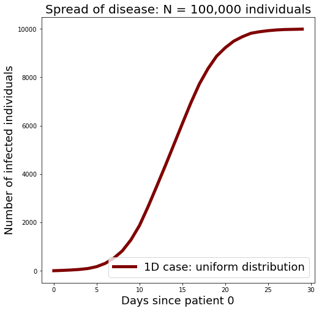

# covid-hacks-2020
 
 

Simulating and working with COVID-19 data. Our simulation implements an arguably naive agent-based approach, storing data in pandas DataFrames.

The *.py files contain the scripts necessary to run the simulations in the dimension of your choosing. "Simulation_notebook.ipynb" produces the relevant plots; "Data exploration.ipynb" and "covid_country_data.ipynb" relate to the COVID-19 case data included in this repository; and "performance_testing.ipynb" includes a variety of benchmarks used in the debugging and optimization of the simulation.

Make sure you have the correct dependencies installed — run

     pip install -r requirements.txt
I would recommend doing so in a fresh conda environment.
